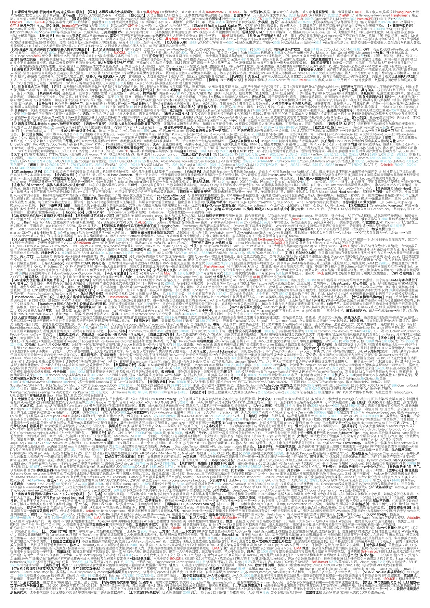
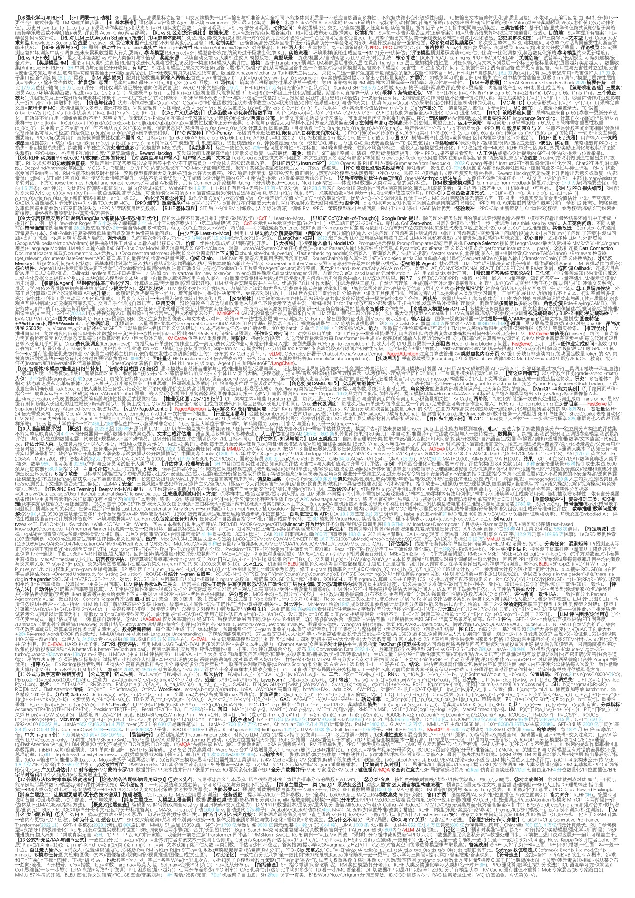

# 一页通关 · OnePageForge

把任意课程的 **几百页 PPT 课件**,变成 **一张 A4 双面极限小抄**。

> 实战验证: 677 页课件 → 2 页 A4(5.5 万字 / 4.5pt)。考场上**所有理论题全部命中**,
> 零漏点。方法核心不是"排版",而是**穷举审计**——保证压缩掉 90% 篇幅的同时,
> 一个考点都不丢。

```
┌──────────┐   ┌──────────────┐   ┌────────────┐   ┌──────────┐
│ 课件 PDF │ → │ AI 压缩成块   │ → │ 排版成 docx │ → │ 校验页数 │ → 打印
└──────────┘   └──────────────┘   └────────────┘   └──────────┘
   (脚本)        (prompts/ 剧本)     (脚本)          (脚本)
```

实战战绩: **677 页课件 → 一张 A4 双面**(下图即真实成品截图,4.5pt 极限规格;
红=关键名词、蓝=数字、粗=考点)。考场实测: 理论题**全部命中,零漏点**:




> 截图已压缩;逐字细节以 make_cheat.py 生成的 docx 为准。内容块格式示例见
> [examples/demo_blocks](examples/demo_blocks/)。(真实成品版权归对应课程作者,
> 仅作效果展示;如需二次分发请先确认课件版权。)

## 它解决什么问题

开卷/半开卷考试的普遍困境:**资料带不全 = 心里没底;全塞进去 = 考场找不到**。
本仓库提供一条流水线:

1. **不漏** —— 用"穷举审计"剧本,以课件原文为金标准逐章核对,把压缩造成的遗漏
   找回来(不是靠 AI 印象,是靠逐条比对);
2. **能塞** —— 排版器按实战验证过的极限参数(4.5pt / 双面 / 红蓝语义色)排版,
   一张 A4 双面约 5 万字;
3. **找得到** —— 块编号 + 颜色标记 + 考前翻练卡,解决"内容全但考场翻得慢"。

## 快速开始(约 1~2 小时,不需要会编程)

### 你需要准备

- Windows 电脑(装有 Microsoft Word)+ Python 3.9+;或任意系统 + LibreOffice
- 一个能读文档的 AI 客户端(豆包 / Kimi / ChatGPT / Claude / 文心… 均可,
  有"多模态看图"能力更佳 —— 现在主流客户端都有)
- 课程课件 PDF;**先确认考场规则**: 允许几张 A4?双面行不行?能彩色打印吗?

### 三步流程

**① 本地跑分析脚本,把课件变成"文本 + 图页清单"**

```bash
pip install -r requirements.txt
# Windows + Word 用户跑页数校验还需:
pip install pywin32
# (非 Windows 用户装 LibreOffice 并加入 PATH 即可,verify_pages.py 自动兜底)

python scripts/analyze_pdf.py 课件.pdf -o analysis_out
#   输出: 全文txt(逐页) + pages_report.csv + 视觉转录候选页.txt(A/B/C 三档)
python scripts/render_pages.py 课件.pdf -f analysis_out/视觉转录候选页.txt -o png_out
#   把候选页渲染成 PNG——公式/图表在 PPT 导出的 PDF 里是图片对象,文字层里没有!
```

**② 按 prompts/ 剧本驱动你的 AI**(核心,约 1 小时)

| 剧本 | 干什么 | 需要喂给 AI 的 |
|---|---|---|
| [01-课件盘点](prompts/01-课件盘点与考点地图.md) | AI 通读全文,产出章节考点地图 | 全文 txt(分章喂) |
| [02-图页转录](prompts/02-图片页与公式页转录.md) | 逐张转录 PNG 里的公式/图表 | ① 渲染出的 PNG |
| [03-极限压缩](prompts/03-知识点极限压缩.md) | 每章压缩成"内容块"(排版器原料) | 章全文 + 考点地图 |
| [04-穷举缺口审计](prompts/04-穷举缺口审计.md) | ⭐ 以原文为金标准逐章查漏补缺 | 小抄全稿 + 章原文 |
| [05-符号一致性自查](prompts/05-符号缩写与一致性自查.md) | 缩写自解释 + 数据冲突标注 | 小抄全稿 |
| [06-考前翻练卡](prompts/06-考前翻练卡.md) | 考前 30 分钟定位自测 | 小抄全稿 |

**③ 排版 → 校验 → 打印**

```bash
python scripts/make_cheat.py "blocks/块*.txt" -o a4_小抄.docx
python scripts/verify_pages.py a4_小抄.docx        # 必须 ≤2 页才算过
```

打印设置: A4、**双面、沿长边翻转**、100% 缩放(不要"适合页面")、彩色。
考前用剧本 06 的翻练卡自测定位,然后进考场。

## 内容块标记语法(排版器解析规则)

AI 按剧本 03 产出的块 txt 直接可排版,只有 5 种标记:

| 写法 | 效果 | 示例 |
|---|---|---|
| `【1·模型结构】` | 块标题,加粗 | 【1·模型结构】 |
| `〈关键名词〉` | 红色加粗(全文同词限 2 次) | 〈Transformer〉 是… |
| `**重点短语**` | 加粗 | **位置编码外推** 的解法是… |
| `名: 内容` | 冒号前字段名自动加粗 | 思路: 拆成子问题 |
| 数字 | 自动蓝色 | 参数量 70B,层数 80 层 |

不喜欢颜色(黑白打印)就加 `--mono`;老师允许更大纸面就 `--font-size 5.5`。

## 常见坑(都是实战踩过的)

- **公式会"凭空消失"**: PPT 另存的 PDF,公式/图表是图片对象,文字层提取为空。
  analyze_pdf.py 用"零文字页 + 大面积图页"双信号自动揪出它们(A/B/C 三档),
  渲染成 PNG 交给 AI 转录即可,不必人工逐页翻 PDF(该规则在 677 页真实课件上
  校准过: 能召回人工筛选内容图页的 94%);
- **课件每页都带插图怎么办**: 候选页 >150 页时不要盲目全转。按剧本 02 附录的
  "两轮工作流": 渲染全部候选 → 让 AI 先快速筛选"哪些页的图含文字层没有的信息"
  → 只对命中页做正式转录,工作量可砍半且不漏;
- **课件是扫描版(整本无文字层)**: analyze_pdf.py 会报告大量 A 档页。此时把 PDF
  分批发给多模态 AI 直接 OCR+整理(每批 30~50 页),拿到文本后再走剧本 03;
- **AI 输出格式乱了**: 剧本 03 要求严格标记语法,若 AI 擅自加 markdown 表格、
  漏写〈〉、一次输出过长,让它"把每个块放进纯文本代码块,逐块输出、逐块确认",
  再继续;
- **压缩一定会漏,必须跑剧本 04**: "AI 凭印象自审"不靠谱,三步法(先列原文考点
  清单 → 逐条比对 → 输出缺口表)实测能把漏报压到零;
- **课件内部会自相矛盾**: 同一模型参数量出现三种写法(652 亿/65.2B/630 亿)——
  剧本 05 会把这类坑标成"疑笔误",考试最爱挖;
- **双面合规先问老师**: 老师只认"一张 A4"的话,双面通常没问题;只许单面就
  `verify_pages.py --max-pages 1` 并大幅砍内容;
- **考前翻练不可省**: 4.5pt 的纸只有"熟悉位置"才能秒翻。考前 30 分钟用剧本 06
  的翻练卡过 2~3 轮,考场策略: 先写论述题抢分,再查细节题;
- **非 Windows 用户先改字体**: config/style.json 里 font.name 默认 "等线 Light"
  (Windows 字体)。LibreOffice/其他系统没有它会**静默替换字体**,4.5pt 的折行、
  密度全部走样,页数校验也会失真。先把 font.name 改成你系统里的中文字体
  (如 Noto Sans CJK SC),再跑 make_cheat.py 与 verify_pages.py;
- **命令行劝退?看两种用法**: 本仓库适合"愿意跑 4 条命令 + 有一个 AI 客户端"的
  人。如果你完全不想碰命令行,把仓库转发给会 Python 的同学代跑脚本,你只负责
  喂 AI;如果你用的客户端支持 Agent(Claude Code / Cursor / ZCode 等),直接把
  本仓库路径丢给它,让它读 README 自主执行——所有剧本和脚本它都能自己调度。

## 目录结构

```
prompts/   剧本(模型无关,复制粘贴给任意 AI)
scripts/   analyze_pdf / render_pages / make_cheat / verify_pages
config/    style.json —— 排版默认参数(字号/行距/颜色/页边距)
examples/  内容块样例(demo_blocks)+ 真实成品案例图(real_case)
```

## 合规声明

本项目仅用于**规则明确允许携带资料**(开卷/半开卷)的考试。使用前请确认你的考场
规则;课件与试题内容版权归原作者所有,examples/real_case 为真实课程成品演示
(版权归对应课程作者,仅作效果展示,二次分发请先确认版权),demo_blocks 为演示数据。
作弊行为与作者无关,请勿用于违规场景。

## License

MIT © HCnets
